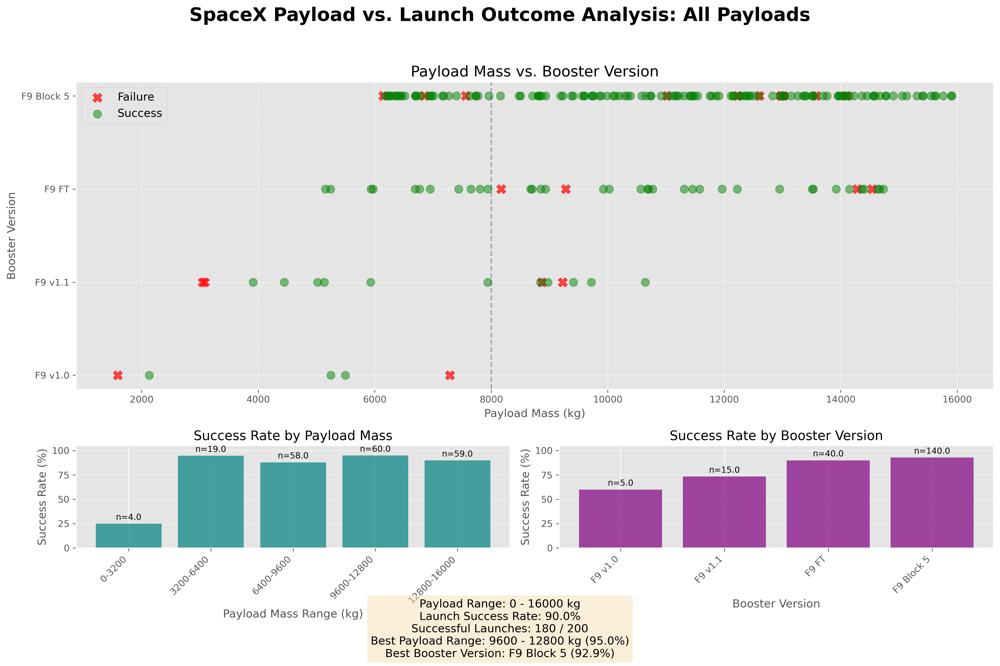
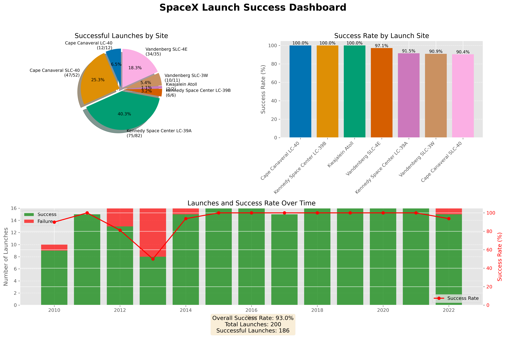
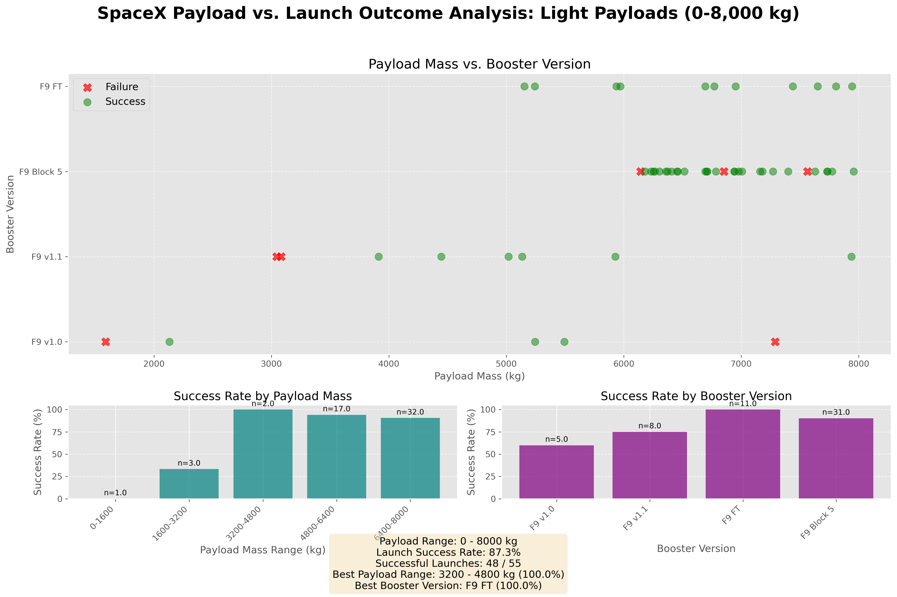

<!-- =========================================================== -->
<!--  IBM Data Science Capstone: SpaceX Falcon 9 Landing Prediction -->
<!-- Enhanced Professional README -->
<!-- =========================================================== -->

<h1 align="center" style="font-family:'Segoe UI',sans-serif; color:#00E5FF;">
🌌 SpaceX Falcon 9 First Stage Landing Prediction
</h1>

  

  <b style="color:#00FFC6;">A Data-Driven AI Framework to Predict Falcon 9 Reusability</b> 
  <i>Developed by Aakif Altaf — Data Scientist | IBM Certified | Google Certified Analyst</i>

---

  
  
  

---

## 🌠 Overview

Predicting the successful landing of a **SpaceX Falcon 9 first stage** is more than a machine learning challenge — it’s an exploration of how data intelligence can reduce costs and optimize rocket reusability.

This project combines **real launch telemetry**, **API-sourced data**, and **machine learning pipelines** to forecast mission outcomes — providing insight into how **SpaceX revolutionized space economics**.

---

##  Tech Stack

| Domain | Tools |
|:--|:--|
| **Language** | Python |
| **Libraries** | Pandas, NumPy, Matplotlib, Seaborn, Scikit-learn, Folium, Plotly Dash |
| **Environment** | Jupyter Notebook, IBM Watson Studio |
| **Data Sources** | SpaceX REST API, Web Scraping (Wikipedia) |

---
---

 

The SpaceX Launch Success Prediction project leveraged a combination of **data engineering, visualization, and machine learning tools** to deliver robust predictive insights.

  <!-- Python & Data Science -->
  
  
  
  
  

  <!-- ML & Modeling -->
  
  
  
  
  

  <!-- Dashboards & Visualization -->
  
  
  

  <!-- Others / Version Control -->
  
  

---

<h2 align="center">🧮 Core Algorithms</h2>

<table align="center">
  <tr>
    <th align="center" width="180" style="background-color:#1a1a1a;color:#00e6b8;">Algorithm</th>
    <th align="center" style="background-color:#1a1a1a;color:#00e6b8;">Purpose & Description</th>
  </tr>
  
  <tr>
    <td align="center" style="background-color:#0d1117;">
       <b>Logistic Regression</b>
    </td>
    <td style="background-color:#0d1117;color:#e6e6e6;">
      Provides a probabilistic model for binary classification of Falcon 9 landing outcomes, helping assess success likelihood based on input features.
    </td>
  </tr>
  
  <tr>
    <td align="center" style="background-color:#0d1117;">
       <b>Decision Tree</b>
    </td>
    <td style="background-color:#0d1117;color:#e6e6e6;">
      Captures non-linear relationships and feature interactions. Visualizes decision paths that influence successful landings.
    </td>
  </tr>
  
  <tr>
    <td align="center" style="background-color:#0d1117;">
       <b>Support Vector Classifier (SVC)</b>
    </td>
    <td style="background-color:#0d1117;color:#e6e6e6;">
      Maximizes separation between classes in high-dimensional space. Ideal for cases where landing outcomes are not linearly separable.
    </td>
  </tr>
  
  <tr>
    <td align="center" style="background-color:#0d1117;">
       <b>K-Nearest Neighbors (KNN)</b>
    </td>
    <td style="background-color:#0d1117;color:#e6e6e6;">
      Uses proximity-based classification to predict outcomes by comparing similar historical launches. Simple yet effective for pattern recognition.
    </td>
  </tr>
  
  <tr>
    <td align="center" style="background-color:#0d1117;">
       <b>Model Evaluation</b>
    </td>
    <td style="background-color:#0d1117;color:#e6e6e6;">
      Metrics like <b>accuracy, confusion matrix, and classification reports</b> quantify model performance and identify misclassifications for improvement.
    </td>
  </tr>
</table>

---

<h2 align="center"> Model Performance</h2>

<table align="center">
  <tr>
    <th align="center" width="180" style="background-color:#1a1a1a;color:#00e6b8;">Model</th>
    <th align="center" style="background-color:#1a1a1a;color:#00e6b8;">Accuracy</th>
    <th align="center" style="background-color:#1a1a1a;color:#00e6b8;">Notes</th>
  </tr>
  
  <tr>
    <td align="center" style="background-color:#0d1117;color:#e6e6e6;"><b>Logistic Regression</b></td>
    <td align="center" style="background-color:#0d1117;color:#00e6b8;"><b>83%</b></td>
    <td style="background-color:#0d1117;color:#e6e6e6;">Baseline model; provides a simple probabilistic benchmark for landing prediction.</td>
  </tr>
  
  <tr>
    <td align="center" style="background-color:#0d1117;color:#e6e6e6;"><b>Decision Tree</b></td>
    <td align="center" style="background-color:#0d1117;color:#00e6b8;"><b>88%</b></td>
    <td style="background-color:#0d1117;color:#e6e6e6;">Best overall performer; captures non-linear relationships and feature interactions effectively.</td>
  </tr>
  
  <tr>
    <td align="center" style="background-color:#0d1117;color:#e6e6e6;"><b>Support Vector Machine (SVM)</b></td>
    <td align="center" style="background-color:#0d1117;color:#00e6b8;"><b>85%</b></td>
    <td style="background-color:#0d1117;color:#e6e6e6;">Margin-based classifier; strong in separating non-linear landing outcome classes.</td>
  </tr>
  
  <tr>
    <td align="center" style="background-color:#0d1117;color:#e6e6e6;"><b>K-Nearest Neighbors (KNN)</b></td>
    <td align="center" style="background-color:#0d1117;color:#00e6b8;"><b>86%</b></td>
    <td style="background-color:#0d1117;color:#e6e6e6;">Performs well with optimized k=3; leverages similarity between past launches for prediction.</td>
  </tr>
</table>

  

<h2 align="center"> Project Methodology</h2>

<table align="center">
  <tr>
    <th align="center" width="180" style="background-color:#1a1a1a;color:#00e6b8;">Phase</th>
    <th align="center" style="background-color:#1a1a1a;color:#00e6b8;">Description</th>
  </tr>
  
  <tr>
    <td align="center" style="background-color:#0d1117;color:#e6e6e6;">
       <b>1️⃣ Data Collection</b>
    </td>
    <td style="background-color:#0d1117;color:#e6e6e6;">
      Fetched launch data using the <b>SpaceX REST API</b> and scraped <b>Wikipedia</b> for supplementary attributes, ensuring a comprehensive dataset.
    </td>
  </tr>
  
  <tr>
    <td align="center" style="background-color:#0d1117;color:#e6e6e6;">
       <b>2️⃣ Data Cleaning</b>
    </td>
    <td style="background-color:#0d1117;color:#e6e6e6;">
      Preprocessed missing values, handled categorical encoding, and refined features for robust model training.
    </td>
  </tr>
  
  <tr>
    <td align="center" style="background-color:#0d1117;color:#e6e6e6;">
       <b>3️⃣ EDA</b>
    </td>
    <td style="background-color:#0d1117;color:#e6e6e6;">
      Visualized launch success trends using <b>Matplotlib</b>, <b>Seaborn</b>, and correlation heatmaps to uncover patterns.
    </td>
  </tr>
  
  <tr>
    <td align="center" style="background-color:#0d1117;color:#e6e6e6;">
       <b>4️⃣ Mapping</b>
    </td>
    <td style="background-color:#0d1117;color:#e6e6e6;">
      Created <b>interactive Folium maps</b> to illustrate launch site performance and regional success patterns.
    </td>
  </tr>
  
  <tr>
    <td align="center" style="background-color:#0d1117;color:#e6e6e6;">
       <b>5️⃣ Model Training</b>
    </td>
    <td style="background-color:#0d1117;color:#e6e6e6;">
      Applied <b>Logistic Regression</b>, <b>Decision Tree</b>, <b>KNN</b>, and <b>SVM</b> models to predict Falcon 9 landing success.
    </td>
  </tr>
  
  <tr>
    <td align="center" style="background-color:#0d1117;color:#e6e6e6;">
       <b>6️⃣ Dashboard</b>
    </td>
    <td style="background-color:#0d1117;color:#e6e6e6;">
      Built an <b>interactive Plotly Dash dashboard</b> for dynamic exploration and visualization of launch success trends.
    </td>
  </tr>
</table>

 

<h2 align="center">🌌 Visual Insights & Strategic Takeaways</h2>

<table align="center" style="max-width:900px;">
  <tr>
    <th align="center" width="250" style="background-color:#0f111a;color:#00ffe6;font-size:18px;"> Visual Insights</th>
    <th align="center" style="background-color:#0f111a;color:#00ffe6;font-size:18px;"> Strategic Takeaways</th>
  </tr>

  <tr>
    <td style="background-color:#111420;color:#e6e6e6;padding:15px;line-height:1.6;">
      <b> Launch Performance Trends:</b> Falcon 9 success rates surged post-2018, reflecting SpaceX’s iterative engineering improvements and operational optimizations.  
      <b> Key Predictive Features:</b> Launch site selection and booster version consistently emerge as the strongest indicators of landing success.  
      <b> Reusability Impact:</b> Data shows a direct correlation between booster reusability models and SpaceX’s cost reduction strategy.
    </td>
    <td style="background-color:#111420;color:#e6e6e6;padding:15px;line-height:1.6;">
      <b> Analytics as Strategy:</b> Data-driven insights now guide aerospace economics and resource allocation decisions.  
      <b> Predictive Reliability:</b> Machine learning models enhance operational planning and boost confidence in reusable launch systems.  
      <b> Storytelling Through Visualization:</b> Interactive and visual outputs bridge complex science with strategic narratives, making insights actionable.
    </td>
  </tr>
</table>

---

## 📊 Dashboard & Insights

Explore the key visualizations derived from SpaceX launch data. These dashboards summarize payload outcomes, launch site trends, and overall mission success probability.  

<!-- 🌌 Payload Outcome Dashboard (0–16,000 kg) -->
<h3 align="center" style="color:#00fff7;">Payload Outcome Dashboard (0–16,000 kg)</h3>

  

<em>Insight:</em> Higher payload mass from Kennedy launch site correlates with higher probability of mission success.

---

<!-- 🚀 SpaceX Launch Success Dashboard -->
<h3 align="center" style="color:#ff00ff;">SpaceX Launch Success Dashboard</h3>

  

<em>Insight:</em> LEO missions demonstrate the highest success rates, while Polar orbits show more variability.

---

<!-- 🛰️ Payload Outcome Dashboard (0–8,000 kg) -->
<h3 align="center" style="color:#00fff7;">Payload Outcome Dashboard (0–8,000 kg)</h3>

  

<em>Insight:</em> Low payload launches indicate marginal success probability; careful planning improves outcomes.

---

<h2 align="center"> Future Enhancements</h2>

<table align="center" style="max-width:800px;">
  <tr>
    <th align="center" width="220" style="background-color:#0f111a;color:#00ffe6;font-size:18px;">Enhancement</th>
    <th align="center" style="background-color:#0f111a;color:#00ffe6;font-size:18px;">Description</th>
  </tr>

  <tr>
    <td align="center" style="background-color:#111420;color:#e6e6e6;padding:15px;">
      <b>📡 Real-Time Telemetry</b>
    </td>
    <td style="background-color:#111420;color:#e6e6e6;padding:15px;line-height:1.6;">
      Incorporate streaming telemetry data to enable instant predictions and adaptive modeling for ongoing launches.
    </td>
  </tr>

  <tr>
    <td align="center" style="background-color:#111420;color:#e6e6e6;padding:15px;">
      <b>🧠 Neural Networks</b>
    </td>
    <td style="background-color:#111420;color:#e6e6e6;padding:15px;line-height:1.6;">
      Leverage deep learning to capture complex, nonlinear relationships between launch parameters and landing outcomes for higher accuracy.
    </td>
  </tr>

  <tr>
    <td align="center" style="background-color:#111420;color:#e6e6e6;padding:15px;">
      <b>🌦️ Weather & Orbital Data</b>
    </td>
    <td style="background-color:#111420;color:#e6e6e6;padding:15px;line-height:1.6;">
      Integrate environmental and orbital conditions as features, enhancing model context and predictive capability.
    </td>
  </tr>

  <tr>
    <td align="center" style="background-color:#111420;color:#e6e6e6;padding:15px;">
      <b>☁️ Cloud-Hosted Dashboard</b>
    </td>
    <td style="background-color:#111420;color:#e6e6e6;padding:15px;line-height:1.6;">
      Deploy the interactive Plotly Dash dashboard as a cloud-based AI service for real-time insights and global accessibility.
    </td>
  </tr>
</table>

---

 <h4 align="center"> |  Author  | </h4>
 
<h3 align="center" style="color:#00E5FF;">👨‍🚀 Aakif Altaf</h3> 
 <b>Data Scientist | AI Innovator | IBM & Google Certified</b>  BCA | MCA | Data Science (IBM) | Data Analytics (Google)  <i>"Machines see data — I teach them to understand meaning."</i> 

<h2 align="center" style="color:#00ffc6;"> A Data-Driven Leap Toward Space Intelligence</h2> 
  

 ⭐ If you found this project inspiring — don’t forget to star the repository and share it with fellow space enthusiasts! 
 

---

## 🎥 Final Presentation

<h4 align="center">|| Click Below ||</h4>

  

*This presentation summarizes the full technical workflow — from data collection and EDA to model building, evaluation, and insights — as developed for the IBM Data Science Capstone Project.*
---
